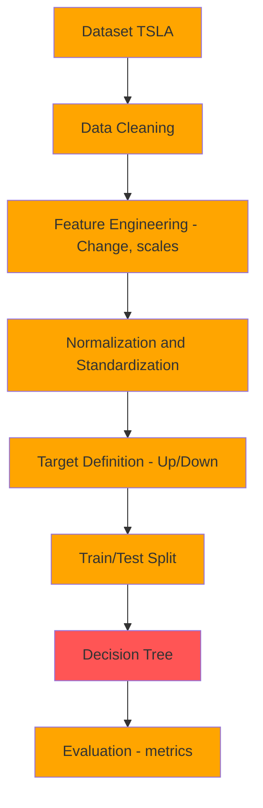
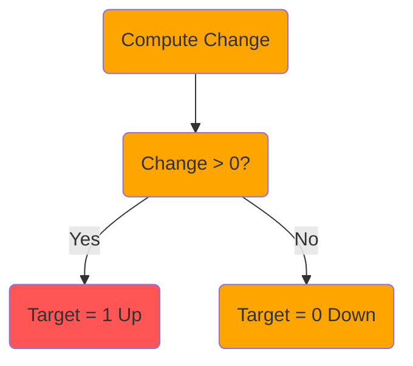

# Exercício I - Machine Learning
## Exploração Kaggle Dataset - TESLA Stock Data

???+ info inline end "Edição"

    2025.2

## Grupo

1. Márcio Alexandroni da Silva Filho

!!! tip "📂 Sobre o Dataset"

    Fonte: Kaggle (dados históricos de ações da Tesla).

    Período: 6/29/2010 a 3/24/2022

    Colunas típicas: 
        Date → Data de negociação 
        Open → Preço de abertura 
        High → Maior preço no dia 
        Low → Menor preço no dia 
        Close → Preço de fechamento 
        Adj Close → Preço ajustado (leva em conta splits e dividendos) 
        Volume → Quantidade de ações negociadas

## Entregas

- [x] Escolha do Dataset
- [x] Limpeza dos Dados
- [x] Normalização e Padronização
- [x] Diagramas Mermaid do Projeto
- [x] Visualizações
- [x] Árvore de Decisão
- [x] Projeto Concluído

## Diagramas

Feito diagramas [Mermaid](https://mermaid.js.org/intro/){:target='_blank'} para a criação dos diagramas de documentação.

### Pipeline do projeto

O pipeline mostra o fluxo de etapas do trabalho, desde o dataset bruto até a avaliação do modelo. Inclui: limpeza dos dados, criação de novas variáveis (Change e escalas), definição do target (Subiu/Caiu), divisão treino/teste, treinamento da árvore de decisão e avaliação do desempenho.

### Lógica do Target

A lógica do target define como criamos a variável de saída do modelo: se a variação diária de fechamento (Change) for positiva, marcamos como 1 (Subiu); se for negativa ou zero, marcamos como 0 (Caiu).

## Exemplo de vídeo

- Em Breve

<!-- <iframe width="100%" height="470" src="https://www.youtube.com/embed/3574AYQml8w" allowfullscreen></iframe>
-->

## Referências

[Material for MkDocs](https://squidfunk.github.io/mkdocs-material/reference/){:target='_blank'}