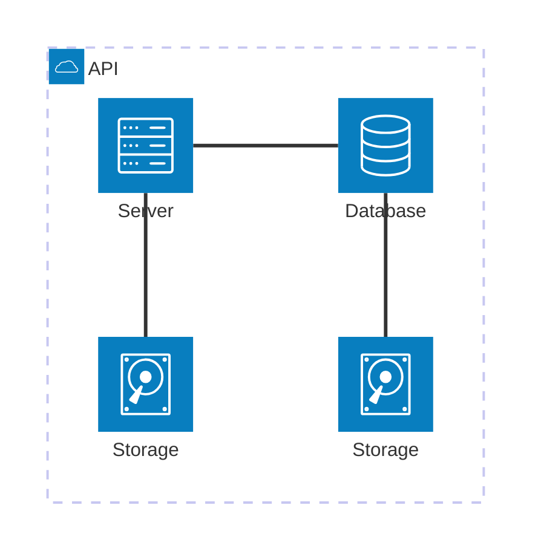

# Objetivo

Exploração e Análise do Kaggle Dataset 'TESLA Stock Data'

# Montagem do Roteiro

## Desafio I

### Tarefas Típicas de Pré-processamento

| Tarefa                 | Descrição                                                                 |
|-------------------------|---------------------------------------------------------------------------|
| **Limpeza de Texto**    | Remove caracteres indesejados, stop words e aplica stemming/lematização. |
| **Normalização**        | Padroniza formatos de texto, como datas e moedas.                         |
| **Tokenização**         | Divide o texto em palavras ou subpalavras para facilitar a análise.       |
| **Extração de Atributos** | Converte o texto em características numéricas usando técnicas como TF-IDF ou embeddings. |
| **Aumento de Dados**    | Gera dados sintéticos para aumentar o tamanho e a diversidade do dataset. |

Arquivo CSV Originl do TSLA Stock Data:

```python exec="on" html="0"
--8<-- "docs/roteiro1/TSLA-original.py"
```
/// caption
Sample rows from Dataset the TSLA Stock Data
///

<h2 id="data-cleaning">Data Cleaning</h2>

A limpeza de dados no dataset da Tesla envolveu a conversão da coluna de datas para o formato datetime, a ordenação cronológica das observações, a remoção da coluna redundante Adj Close e a verificação de duplicatas ou valores ausentes, que não foram encontrados. Essas etapas garantem consistência e preparação adequada dos dados para a análise e modelagem.


Instalando o MAAS:

<!-- termynal -->

``` bash
sudo snap install maas --channel=3.5/Stable
```


/// caption
Dashboard do MAAS
///

Conforme ilustrado acima, a tela inicial do MAAS apresenta um dashboard com informações sobre o estado atual dos servidores gerenciados. O dashboard é composto por diversos painéis, cada um exibindo informações sobre um aspecto específico do ambiente gerenciado. Os painéis podem ser configurados e personalizados de acordo com as necessidades do usuário.

### Desafio II

## App


### Tarefa 1

### Tarefa 2

Exemplo de diagrama



[Mermaid](https://mermaid.js.org/syntax/architecture.html){:target="_blank"}

## Questionário, Projeto ou Plano

Esse seção deve ser preenchida apenas se houver demanda do roteiro.

## Discussões

Quais as dificuldades encontradas? O que foi mais fácil? O que foi mais difícil?

## Conclusão

O que foi possível concluir com a realização do roteiro?
