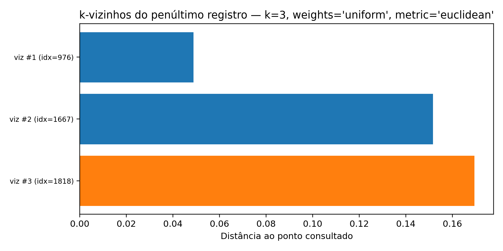
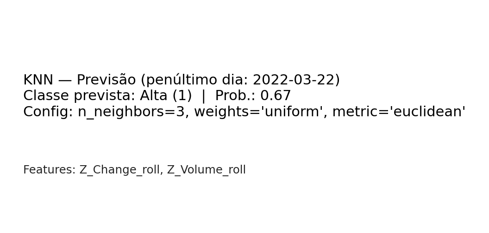
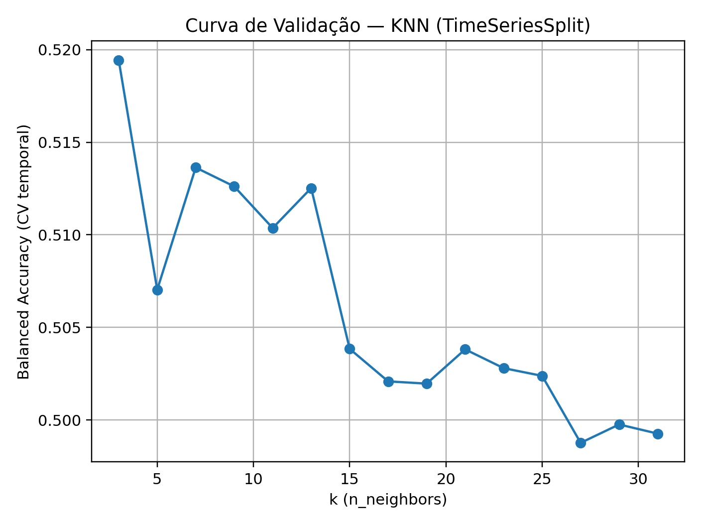
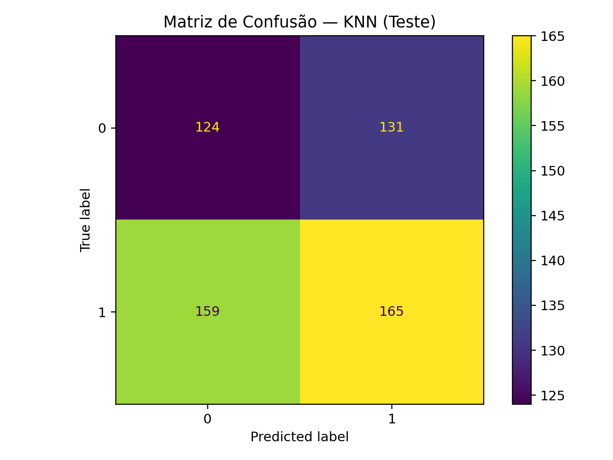
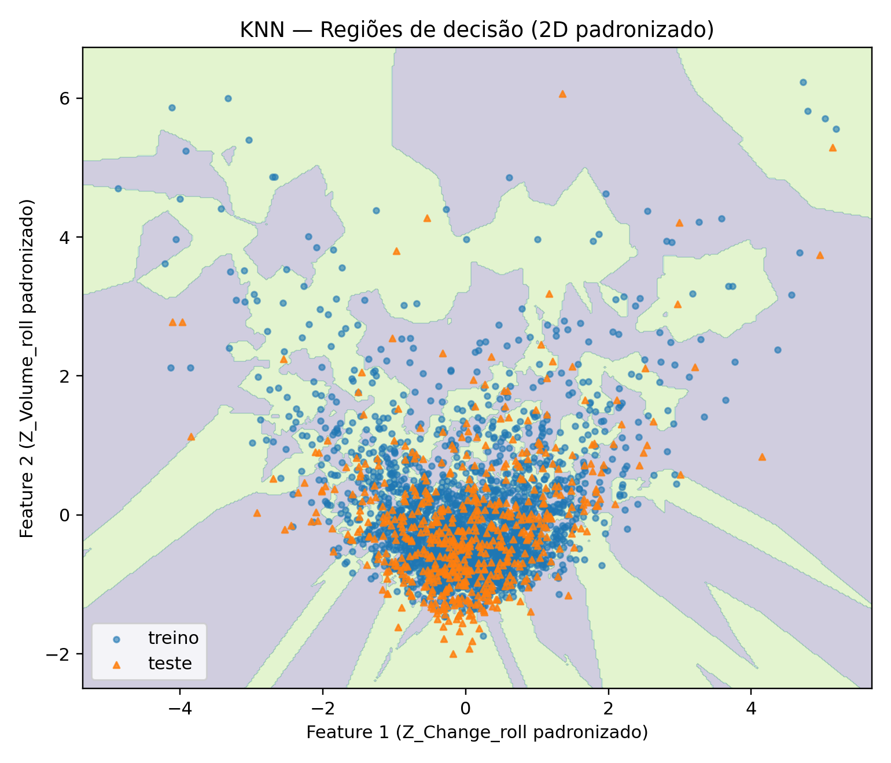

# KNN — TSLA (Direção do Próximo Dia)

{ align=center }

> **Objetivo:** Classificar a **direção do próximo dia** (alta=1, queda=0) da TSLA com **K-Nearest Neighbors (KNN)** usando validação temporal.

## Como utilizamos o KNN no projeto
- **O que prevemos:** `Target(t+1)=1` se `Change(t+1)>0`, senão `0`.
- **Variáveis:** `Volume`, `N-Volume`, `Z-Volume`, `Change`, `N-Change`, `Z-Change`.
- **Pipeline:** Padronização antes de medir distâncias (`SimpleImputer(median) → StandardScaler → KNN`).
- **Série temporal:** split `80/20` + `TimeSeriesSplit (5)`.
- **Escolha do modelo:** maior **acurácia média** e **pico estável** na curva de validação.
- **erega:** pipeline final gera **previsão** e **probabilidade**; exibimos um **badge** com o resultado do **penúltimo dia**.

## Métricas utilizadas
- **Accuracy**, **Precision/Recall (classe 1)**, **F1 (classe 1)** e **F1 ponderado**.
- **Matriz de confusão** para leitura de **TP/TN/FP/FN** e análise de **FP vs FN**.  
  *Arquivos: `./knn_tsla_metrics.csv`, `./knn_tsla_confusion_matrix.csv`.*

## Visualizações
{ align=center }  
*Distâncias dos **k vizinhos** ao ponto consultado; cor indica a classe do vizinho.*

{ align=center }  
*Classe prevista, probabilidade e configuração do KNN (penúltimo registro).*

{ align=center }  
*Acurácia média da validação temporal por `k`.*``

{ align=center }  
*Heatmap no **hold-out** (20% final).*

{ align=center }
*Fronteira em 2D para uma **amostra contínua didática** da TSLA. Métrica acima é do **treino na amostra** (ilustrativa).*

{ align=center }  
*Regiões de decisão após **PCA(2D)** (visualização).*

## Resultado & conclusão
- **Seleção de `k`** guiada pela curva de validação com comportamento estável.
- **Avaliação** no teste confirma desempenho conforme métricas e matriz.
- Com imputação, padronização e validação temporal, o **KNN** funciona como **baseline não-paramétrico**; sinais de **variação de preço** e **intensidade de volume** aproximam vizinhos da mesma classe.

## Limitações & próximos passos
- **Limitações:** custo preditivo (distâncias), sensível à escala/ruído e à alta dimensionalidade.
- **Próximos passos:** testar `metric='manhattan'`, ajustar `k` por regime de mercado, enriquecer features (médias/volatilidades móveis) e comparar com **Árvore/Florestas** mantendo `TimeSeriesSplit`.